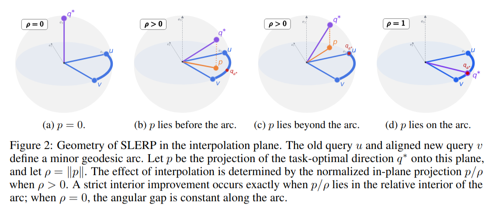

# Spherical Interpolation for Backward-Compatible Multimodal Representations

[](https://arxiv.org/abs/2609.39836)
[](#)
[](#)
[](#installation-guide)

This is the **official repository** of the **NeurIPS 2026 paper**
"*Spherical Interpolation for Backward-Compatible Multimodal Representations*"
by Simone Ricci, Niccolò Biondi and Federico Pernici.

## Overview

### Abstract
Contrastive vision-language models map visual and textual representations into a shared normalized embedding space, making cosine similarity the natural metric for cross-modal retrieval. A practical challenge arises during model upgrades: independently trained models generally produce incompatible representation spaces, so replacing a deployed model typically requires recomputing embeddings for the entire gallery, which is prohibitively expensive at scale. Orthogonal post-hoc alignment can partially mitigate this problem by mapping new-model queries into the old-model gallery space. However, because independently trained models can differ in fine-grained representation structure, the orthogonal alignment remains approximate, leaving a residual angular discrepancy between the old-model query and the aligned new-model query. We study whether interpolation along the spherical geodesic between these two normalized query representations can improve retrieval without re-indexing the gallery. We characterize when this path contains an interior query direction closer to an idealized retrieval-optimal direction than either endpoint, and connect this characterization to Recall@K through a local margin-based certification result. Experiments across multiple benchmarks and model families show that post-alignment spherical interpolation improves over orthogonal alignment alone, recovering backward-compatibility in most evaluated settings. Consistent with our geometric characterization, per-query oracle analysis shows that retrieval-favorable interior points occur frequently in practice.



Geometry of SLERP in the interpolation plane. The old-model query $`u`$ and the Procrustes-aligned new-model query $`v`$ define a minor geodesic arc. Let $`p`$ be the projection of the retrieval-optimal direction $`q^*`$ onto this plane: a strict interior improvement over both endpoints occurs exactly when $`p/\lVert p \rVert`$ lies in the relative interior of the arc.

### Method in a Nutshell

1. **Align**: estimate an orthogonal map $`R^\star`$ from new-model to old-model embeddings by solving the orthogonal Procrustes problem on a small alignment support set (CC3M validation split), in closed form via SVD.
2. **Interpolate**: for each query, move along the spherical geodesic between the old-model query $`u = \phi_{\text{old}}(x)`$ and the aligned new-model query $`v = \phi_{\text{new}}(x)\,R^\star`$:

```math
   q_\alpha = \frac{\sin((1-\alpha)\theta)}{\sin\theta}\,u + \frac{\sin(\alpha\theta)}{\sin\theta}\,v, \qquad \theta = \angle(u, v).
```

3. **Retrieve**: search the **unchanged** old-model gallery with $`q_\alpha`$, using a single weight $`\hat{\alpha}`$ selected on the support set.

> **Unequal embedding dimensions.** When $`d_{\text{new}} > d_{\text{old}}`$ (e.g., ViT-L/14 → ViT-B/32), the old-model embeddings are zero-padded to $`d_{\text{new}}`$, so that $`R^\star`$ is a square orthogonal matrix and $`v`$ stays on the unit sphere. Interpolation and retrieval then happen in $`\mathbb{R}^{d_{\text{new}}}`$, where the padded coordinates of the gallery are zero: retrieval scores only depend on the first $`d_{\text{old}}`$ coordinates of $`q_\alpha`$, and the old-model gallery is never modified. When $`d_{\text{new}} \le d_{\text{old}}`$, $`R^\star`$ is a rectangular map with orthonormal rows and no padding is needed.

No model retraining, no gradient-based optimization, and no gallery re-indexing.

### Highlights
- Evaluated on **CLIP**, **SigLIP1** and **SigLIP2** upgrades (same-family and cross-family, equal and unequal embedding dimensions) on **Flickr30k**, **COCO** and **NoCaps**.
- Across 90 compatibility evaluations, SLERP with the CC3M-selected weight satisfies backward compatibility in **85** cases, versus **45** for orthogonal alignment alone.
- Competitive with the training-based XBT baseline without any compatibility training.
- The weight selected on CC3M transfers across datasets, close to the per-dataset oracle.
- Also effective when the gallery is re-indexed and for zero-shot classification.

## Citation
```bibtex
@inproceedings{ricci2026spherical,
  title     = {Spherical Interpolation for Backward-Compatible Multimodal Representations},
  author    = {Ricci, Simone and Biondi, Niccol{\`o} and Pernici, Federico},
  booktitle = {Advances in Neural Information Processing Systems},
  volume    = {39},
  year      = {2026}
}
```

<details>
<summary><h2>Procrustes Alignment + SLERP</h2></summary>

Minimal reference implementation of the two steps of our approach.

```python
import torch
import torch.nn.functional as F

def procrustes(V_new, U_old):
    """
    Closed-form (rectangular) orthogonal Procrustes alignment.

    Args:
        V_new (torch.Tensor): New-model support embeddings, shape [N, d_new] (L2-normalized).
        U_old (torch.Tensor): Old-model support embeddings, shape [N, d] (L2-normalized),
            zero-padded to d = max(d_new, d_old).
    Returns:
        R (torch.Tensor): Alignment map, shape [d_new, d].
    """
    P, _, Qt = torch.linalg.svd(V_new.T @ U_old, full_matrices=False)
    return P @ Qt

def slerp(u, v, alpha, eps=1e-7):
    """
    Spherical linear interpolation between old-model queries u and aligned new-model queries v.

    Args:
        u (torch.Tensor): Old-model queries, shape [B, d].
        v (torch.Tensor): Aligned new-model queries, shape [B, d].
        alpha (float): Interpolation weight (0 = old model, 1 = aligned new model).
    Returns:
        q (torch.Tensor): Interpolated unit-norm queries, shape [B, d].
    """
    u, v = F.normalize(u, dim=-1), F.normalize(v, dim=-1)
    cos = (u * v).sum(-1, keepdim=True).clamp(-1 + eps, 1 - eps)
    theta = torch.acos(cos)
    q = (torch.sin((1 - alpha) * theta) * u + torch.sin(alpha * theta) * v) / torch.sin(theta)
    return F.normalize(q, dim=-1)

# Usage
d = max(V_support.shape[1], U_support.shape[1])
pad = lambda x: F.pad(x, (0, d - x.shape[-1]))  # zero-pads the old space when d_new > d_old
R = procrustes(V_support, pad(U_support))
v = new_query_emb @ R
q = slerp(pad(old_query_emb), v, alpha=0.5)
scores = q @ pad(old_gallery).T                 # = q[:, :d_old] @ old_gallery.T: the gallery is left untouched
```
</details>

## Installation Guide

```bash
git clone https://github.com/miccunifi/SLERP_backward_compatibility.git
cd SLERP_backward_compatibility

conda create -n slerp python=3.11 -y
conda activate slerp
pip install -r requirements.txt
```

### Repository structure

```
SLERP_backward_compatibility/
├── extract_features.py          # step 1: encode images and captions with OpenCLIP
├── main.py                      # step 2: Procrustes + SLERP, alpha selection, retrieval evaluation
├── slerp_bc/
│   ├── data.py                  # dataset readers (CC3M, Flickr30k, COCO, NoCaps)
│   ├── models.py                # model registry (OpenCLIP)
│   ├── method.py                # procrustes() and slerp()
│   ├── retrieval.py             # Recall@K for image-to-text and text-to-image retrieval
│   ├── table.py                 # builds the paper table from the results CSV
│   └── utils.py                 # device selection (CUDA if available)
├── notebooks/results_table.ipynb  # reproduces the table and plots Recall@1 vs. alpha
├── results/l14_to_b32.csv       # our results for CLIP ViT-L/14 -> CLIP ViT-B/32
├── assets/cc3m_val.csv          # the 12,637 CC3M validation pairs used as support set
└── scripts/download_images.py   # downloads the CC3M and NoCaps validation images
```

### Data preparation

Download the datasets and organize them as follows (only the files listed are needed):

| Dataset | Role | Expected layout |
|---|---|---|
| [CC3M](https://ai.google.com/research/ConceptualCaptions/download) validation | support set (12,637 pairs) | `cc3m/val/*.jpg` (pairs listed in `assets/cc3m_val.csv`) |
| [Flickr30k](https://shannon.cs.illinois.edu/DenotationGraph/) | test (31,014 images, all Karpathy splits) | `Flickr30K/dataset_flickr30k.json`, `Flickr30K/images/*.jpg` |
| [COCO 2014](https://cocodataset.org/#download) | test (35,504 images, Karpathy val + restval) | `COCO2014/dataset_coco.json`, `COCO2014/val2014/*.jpg` |
| [NoCaps](https://nocaps.org/download) validation | test (4,500 images) | `nocaps/nocaps_val_4500_captions.json`, `nocaps/val/*.jpg` |

- `dataset_flickr30k.json` and `dataset_coco.json` are the [Karpathy splits](https://cs.stanford.edu/people/karpathy/deepimagesent/).
- CC3M and NoCaps are distributed as URLs. Download the images with
  ```bash
  python scripts/download_images.py --dataset cc3m   --root /path/to/cc3m     # 12,637 pairs of assets/cc3m_val.csv
  python scripts/download_images.py --dataset nocaps --root /path/to/nocaps   # needs nocaps/nocaps_val_4500_captions.json
  ```
  `assets/cc3m_val.csv` lists the CC3M validation pairs that were available when we ran the experiments. Some URLs may have expired since: missing images are skipped, which can slightly change the results.

Dataset paths can be set once in `DATA_ROOTS` at the top of `extract_features.py`, or passed with `--root`.

## Evaluation

The example below reproduces the **CLIP ViT-L/14 → CLIP ViT-B/32** upgrade of Table 1: the gallery is encoded by the old model (ViT-B/32) and queries come from the new model (ViT-L/14).

**1. Extract features** (once per dataset; saved to `features/<dataset>/<model>.pt`):

```bash
python extract_features.py --dataset cc3m      --root /path/to/cc3m      --models b32 l14
python extract_features.py --dataset flickr30k --root /path/to/Flickr30K --models b32 l14
python extract_features.py --dataset coco      --root /path/to/COCO2014  --models b32 l14
python extract_features.py --dataset nocaps    --root /path/to/nocaps    --models b32 l14
```

**2. Align, interpolate and evaluate:**

```bash
python main.py --new_model l14 --old_model b32
```

For each support modality (text `T`, image `I`, both `I+T`), `main.py` fits the Procrustes map on CC3M val, evaluates SLERP for α ∈ {0, 0.1, …, 1} on CC3M and on Flickr30k, COCO and NoCaps, selects α̂ by maximizing CC3M Recall@1 (separately for I2T and T2I), and prints the table. α = 0 is the old model and α = 1 is Procrustes alignment alone (SVD). All Recall@{1, 5, 10} values are saved to `results/l14_to_b32.csv`. Expected output (Recall@1, %):

```
l14 -> b32  |  Recall@1, alpha_hat selected on cc3m:
      I2T  T2I
Sup.
T     0.7  0.5
I     0.7  0.4
I+T   0.7  0.4

                 flickr30k              coco            nocaps
                       I2T      T2I      I2T      T2I      I2T      T2I
Method      Sup.
Old model   -        40.62    21.73    28.77    14.47    71.31    45.24
SVD         T      42.89 ✓  21.49 ×  30.28 ✓  14.03 ×  69.22 ×  43.92 ×
+SLERP (α̂) T      48.00 ✓  23.33 ✓  33.41 ✓  15.26 ✓  74.00 ✓  46.59 ✓
+SLERP (α★) T      48.61 ✓  23.33 ✓  33.85 ✓  15.27 ✓  75.64 ✓  46.65 ✓
SVD         I      41.18 ✓  19.99 ×  28.71 ×  13.11 ×  65.91 ×  42.16 ×
+SLERP (α̂) I      46.30 ✓  23.00 ✓  31.77 ✓  15.14 ✓  71.44 ✓  46.49 ✓
+SLERP (α★) I      47.39 ✓  23.00 ✓  32.51 ✓  15.15 ✓  73.80 ✓  46.51 ✓
SVD         I+T    42.44 ✓  21.80 ✓  29.95 ✓  14.16 ×  69.16 ×  44.41 ×
+SLERP (α̂) I+T    47.09 ✓  23.44 ✓  33.04 ✓  15.30 ✓  73.58 ✓  46.98 ✓
+SLERP (α★) I+T    47.77 ✓  23.44 ✓  33.31 ✓  15.35 ✓  74.80 ✓  46.98 ✓
New model   -        48.73    28.28    34.33    18.69    73.36    47.84
```

✓ / × indicate whether backward compatibility (M<sub>new→old</sub> > M<sub>old→old</sub>) is satisfied. Values may differ from the paper by a few hundredths of a point (≤ 0.05 in our runs) because of floating-point non-determinism in feature extraction and near-ties in similarity search.

**3. Visualize the results:** open `notebooks/results_table.ipynb` to rebuild the table, and plot Recall@1 along the geodesic.

Other model combinations can be evaluated by changing `--new_model` / `--old_model` (`b32`, `l14`, `h14`, `siglip1`, `siglip2`) and extracting the corresponding features with `--models`.

## Authors
* [**Simone Ricci**](https://scholar.google.com/citations?user=jtj_lhAAAAAJ&hl)
* [**Niccolò Biondi**](https://scholar.google.com/citations?user=B7VHm9UAAAAJ)
* [**Federico Pernici**](https://scholar.google.com/citations?user=I8nFKUsAAAAJ)

## Contact
For questions, please contact **Simone Ricci** at simone.ricci@unifi.it.
